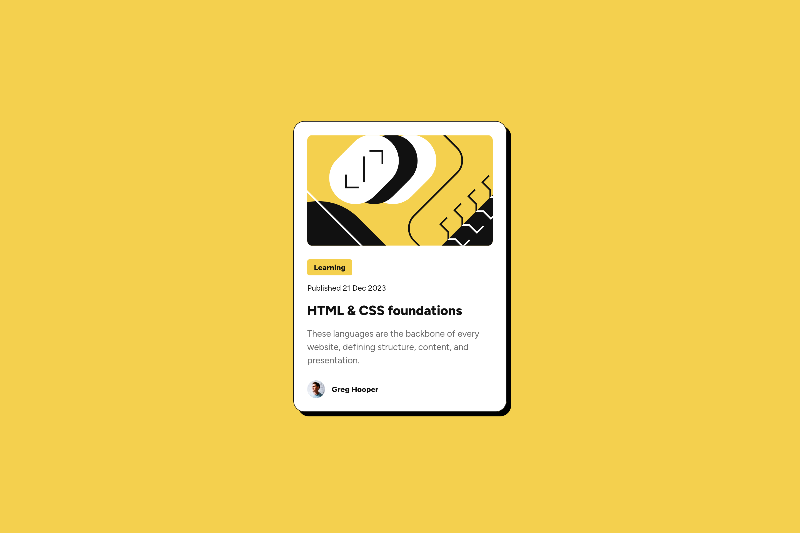

# Frontend Mentor - Blog preview card solution

This is a solution to the [Blog preview card challenge on Frontend Mentor](https://www.frontendmentor.io/challenges/blog-preview-card-ckPaj01IcS). Frontend Mentor challenges help you improve your coding skills by building realistic projects. 

## Table of contents

- [Overview](#overview)
  - [The challenge](#the-challenge)
  - [Screenshot](#screenshot)
  - [Links](#links)
- [My process](#my-process)
  - [Built with](#built-with)
  - [What I learned](#what-i-learned)
  - [Continued development](#continued-development)
  - [Useful resources](#useful-resources)
- [Author](#author)

## Overview

### The challenge

Users should be able to:

- See hover and focus states for all interactive elements on the page

### Screenshot

### Links

- Solution URL: [GitHub](https://github.com/marisudris/frontendmentor-projects/tree/main/blog-preview-card-main)
- Live Site URL: [GitHub Pages](https://marisudris.github.io/frontendmentor-projects/blog-preview-card-main/)

## My process

### Built with

- Semantic HTML5 markup
- CSS custom properties
- Flexbox
- CSS Grid
- Mobile-first workflow

### What I learned

Continued to hone my Figma skills and apply them to web development. Also tried and use container query units for fluid font sizing.

### Continued development

Keep exploring Figma and other design tools to improve my design conversion skills.

### Useful resources

- [Figma for Developers: How to Work with a Design File](https://www.frontendmentor.io/articles/figma-for-developers-how-to-work-with-a-design-file-m6CZKZ1rC1) - Great guide on working with Figma design files.

## Author

- Frontend Mentor - [@marisudris](https://www.frontendmentor.io/profile/marisudris)
- GitHub - [@marisudris](https://github.com/marisudris)
