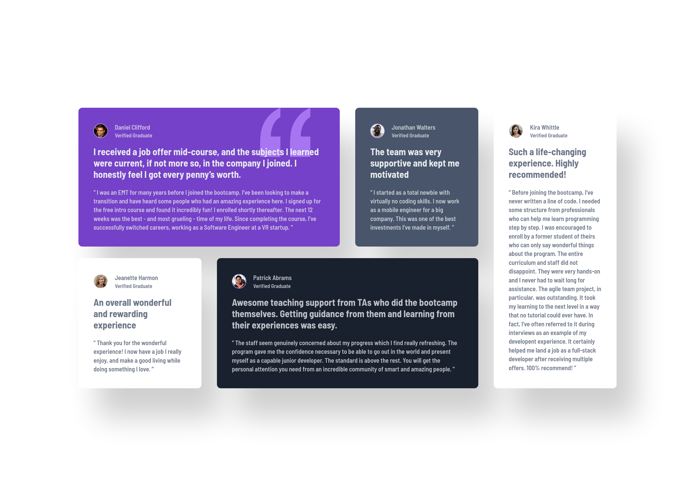

# Frontend Mentor - Testimonials grid section solution

This is a solution to the [Testimonials grid section challenge on Frontend Mentor](https://www.frontendmentor.io/challenges/testimonials-grid-section-Nnw6J7Un7). Frontend Mentor challenges help you improve your coding skills by building realistic projects. 

## Table of contents

- [Overview](#overview)
  - [The challenge](#the-challenge)
  - [Screenshot](#screenshot)
  - [Links](#links)
- [My process](#my-process)
  - [Built with](#built-with)
  - [What I learned](#what-i-learned)
  - [Continued development](#continued-development)
  - [Useful resources](#useful-resources)
- [Author](#author)

## Overview

### The challenge

Users should be able to:

- View the optimal layout for the site depending on their device's screen size

### Screenshot

### Links

- Solution URL: [GitHub](https://github.com/marisudris/frontendmentor-projects/tree/main/testimonials-grid-section)
- Live Site URL: [GitHub Pages](https://marisudris.github.io/frontendmentor-challenges/testimonials-grid-section/)

## My process

### Built with

- Semantic HTML5 markup
- CSS custom properties
- Flexbox
- CSS Grid

### What I learned

Accidentally learned that custom CSS properties can't be used in media queries, which is a bummer. IDE search tools are really helpful for finding things in these circumstances.

### Continued development

I "eyeballed" the layout and text properties from images, which isn't ideal. Working from Figma design files is preferable.

## Author

- Frontend Mentor - [@marisudris](https://www.frontendmentor.io/profile/marisudris)
- GitHub - [@marisudris](https://github.com/marisudris)
